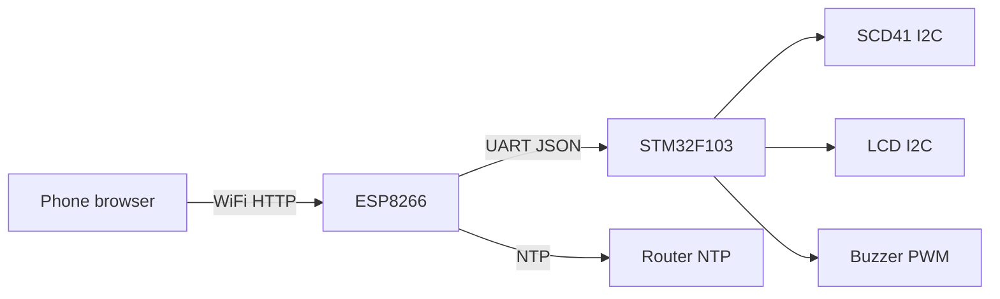
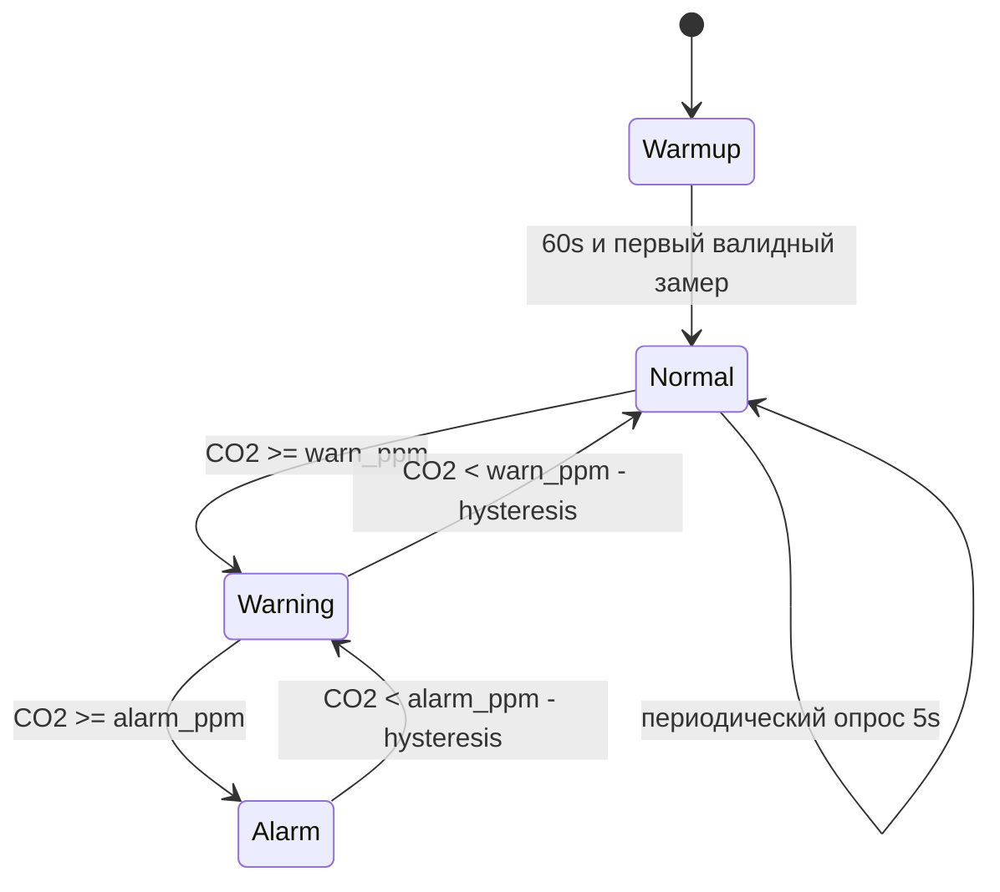
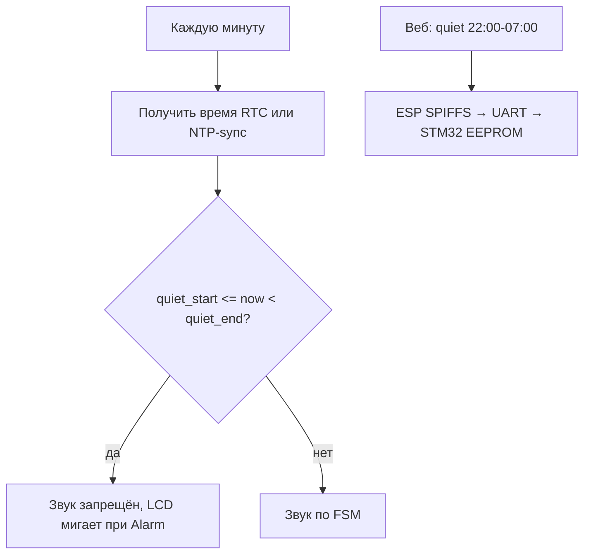

# CO2-монитор: STM32 + WiFi + LCD + звук

## Рекомендация по датчику

| Датчик | Что измеряет | Точность CO2 | Интерфейс | Для комнаты |
|--------|--------------|--------------|-----------|-------------|
| **CCS811** | eCO2 (расчёт по TVOC) | ±50–150 ppm, сильно зависит от запахов/прогрева | I2C | Слабый выбор для «уровня CO2» |
| **SCD41** (рекомендуется) | Настоящий CO2 (NDIR) | ±(40 ppm + 5%) | I2C | Лучший баланс цена/точность/размер |
| **SCD30** | Настоящий CO2 | чуть хуже SCD41 | I2C | Альтернатива, крупнее |
| **MH-Z19B** | Настоящий CO2 | ±(50 ppm + 5%) | UART | Дешевле, но занимает отдельный UART |

**Вывод:** для комнатного монитора с порогами и звуком **берите SCD41** (или SCD30). CCS811 годится только как «индикатор духоты/запахов», а не как измеритель CO2 — пользователи часто разочаровываются в показаниях.

SCD41 дополнительно отдаёт температуру и влажность — пригодится для компенсации и отображения на LCD.

---

## Рекомендация по связи с телефоном

Оптимальный вариант для DIY без разработки мобильного приложения:

**Локальный веб-интерфейс + REST API на ESP8266**, STM32 — «мозг» датчиков и UI.



Почему так:
- Телефон открывает `http://co2-monitor.local/` — график, пороги, «тихие часы», OTA.
- Не нужен App Store, облако и аккаунты.
- Позже можно добавить **MQTT** (Home Assistant) одной прошивкой ESP — без смены STM32.

---

## Архитектура системы

### Роли модулей

| Модуль | Задачи |
|--------|--------|
| **STM32F103C8T6** | Опрос SCD41, FSM алертов, LCD, buzzer, локальная логика «тихих часов», UART-протокол |
| **ESP8266** (ESP-01S или ESP-12F на плате) | WiFi, NTP, веб-сервер, хранение настроек (SPIFFS), OTA себя, прокси OTA для STM32 |
| **DS3231 RTC** (опционально, но желательно) | Время без WiFi; после синхронизации NTP — автокоррекция |

Без RTC время ночью «упадёт» при отключении роутера — для «тихих часов» **RTC strongly recommended** (~100 ₽).

### Разделение ответственности

STM32 работает **автономно**: LCD и пороги работают даже если WiFi упал. ESP — сетевой «сатellite».

---

## Схема подключения (логическая)

```
3.3V rail (стабильный БП 5V → AMS1117-3.3, ≥500 mA)
├── STM32F103 (Blue Pill)
├── SCD41 (I2C)
├── LCD 1602 + PCF8574 (I2C, addr 0x27)
├── DS3231 (I2C, addr 0x68)
└── ESP8266 (3.3V! не 5V)

I2C шина (PB6=SCL, PB7=SDA + pull-up 4.7k):
  SCD41, LCD, DS3231

UART STM32 ↔ ESP8266:
  STM32 PA2(TX) → ESP RX
  STM32 PA3(RX) ← ESP TX
  ESP GPIO0/CH_PD — подтяжки для нормального boot
  Скорость: 115200

Buzzer (активный или пьезо):
  STM32 PB0 → NPN транзистор → buzzer → 5V (или 3.3V для малого)
  PWM (TIM3) для мелодии/уровня громкости

Кнопка (опционально): PA0 — mute / сброс baseline
```

**Важно:** ESP8266 и SCD41 строго **3.3 V**. Общая земля обязательна.

---

## Логика измерения и алертов

### FSM состояний



### Пороги по умолчанию (ppm)

- **Норма:** &lt; 800 — зелёный на LCD
- **Warning:** 800–1200 — жёлтый, короткий beep раз в 5 мин (если не quiet hours)
- **Alarm:** &gt; 1200 — красный, повторяющийся beep каждые 30 с (если не quiet hours)

Гистерезис 50 ppm, чтобы не «дребезжало» на границе.

### «Тихие часи» (ночью без звука)



**Правила:**
- По умолчанию: **22:00–07:00** (локальное время, timezone в настройках ESP).
- Ночью: LCD продолжает показывать CO2; при Alarm — **мигание подсветки/иконки**, без buzzer.
- Кнопка «Mute» глушит звук на 1 час даже днём.
- Настройки `quiet_start`, `quiet_end`, `timezone` хранятся во flash STM32 (дублируются на ESP).

**Синхронизация времени:** ESP при старте — NTP → UART `SET_TIME` → STM32 → DS3231. Повтор каждые 24 ч.

---

## UART-протокол STM32 ↔ ESP8266

Простой текстовый JSON по строкам (легко отлаживать в Serial Monitor):

**STM32 → ESP (каждые 5 с):**
```json
{"co2":845,"temp":23.1,"rh":45,"state":"warning","quiet":true}
```

**ESP → STM32 (команды):**
```json
{"cmd":"set_thresholds","warn":800,"alarm":1200}
{"cmd":"set_quiet","start":"22:00","end":"07:00","tz":"Europe/Moscow"}
{"cmd":"set_time","epoch":1719320000}
{"cmd":"mute","minutes":60}
```

---

## WiFi и OTA

### Модуль
**ESP-12F** на отдельной маленькой плате или **ESP-01S** (меньше flash — для OTA двух чипов лучше ESP-12F с 4 MB).

### OTA — двухуровневая схема

1. **OTA ESP8266** — штатный Arduino/ESP8266 OTA или ElegantOTA через веб (`/update`).
2. **OTA STM32** — ESP скачивает `.bin` по HTTP и прошивает STM32 через **serial bootloader** (USART1 на PA9/PA10 в boot mode) или custom **IAP bootloader** во flash STM32.

Практичный путь для v1:
- OTA только ESP на первом этапе.
- STM32 обновлять через **USB-UART** (встроенный CH340 на Blue Pill) или второй UART через ESP passthrough.
- v2: добавить IAP bootloader на STM32 (8 KB в начале flash).

### Первичная настройка WiFi
**WiFiManager** (ESP): при первом включении AP `CO2-Setup` → телефон → SSID/пароль → сохранение.

---

## LCD и звук

### LCD
- **1602 I2C** (HD44780 + PCF8574) — 4 провода, минимум GPIO.
- Строка 1: `CO2: 845 ppm  [OK]`
- Строка 2: `23.1C  45%  22:15` или `!! VENT ROOM !!`

Обновление раз в 1–2 с (не каждый опрос датчика).

### Звук
- Короткий beep (200 ms, 2 kHz) — Warning.
- Серия из 3 beep — Alarm.
- `quiet_hours` → полное отключение PWM на buzzer.

---

## Структура прошивки (новый репозиторий)

Рекомендуется **отдельный git-репозиторий**, не текущий «Символьная регрессия»:

```
co2-monitor/
├── firmware/
│   ├── stm32/          # PlatformIO, framework=stm32cube or libopencm3
│   │   ├── src/
│   │   │   ├── main.c
│   │   │   ├── scd41.c
│   │   │   ├── lcd_i2c.c
│   │   │   ├── buzzer.c
│   │   │   ├── rtc_ds3231.c
│   │   │   ├── alert_fsm.c
│   │   │   ├── quiet_hours.c
│   │   │   └── esp_link.c
│   │   └── platformio.ini
│   └── esp8266/        # Arduino core
│       ├── src/main.cpp
│       ├── web_server.cpp
│       ├── ntp_sync.cpp
│       └── ota.cpp
├── hardware/
│   ├── schematic.md    # KiCad позже
│   └── bom.md            # список компонентов
└── README.md
```

**PlatformIO** — единая сборка для обоих MCU, проще CI и OTA-артефакты.

---

## BOM (ориентировочно)

| Компонент | Кол-во | Примечание |
|-----------|--------|------------|
| STM32F103C8T6 (Blue Pill) | 1 | |
| SCD41 | 1 | Sensirion, ~1500–2500 ₽ |
| ESP-12F + антенна | 1 | или ESP-01S |
| LCD 1602 I2C | 1 | |
| DS3231 module | 1 | CR2032 |
| Buzzer 5V + BC547 | 1 | |
| AMS1117-3.3 | 1 | если питание 5V |
| Конденсаторы 100nF + 10µF | несколько | развязка |
| Корпус с вентиляционными отверстиями | 1 | CO2 нужен поток воздуха |

---

## Этапы реализации

### Этап 1 — «Железо на столе»
- Сборка breadboard: SCD41 + LCD + STM32.
- Прошивка: опрос SCD41, вывод на LCD, Serial log.
- Проверка: выдох на датчик → рост CO2 за 30–60 с.

### Этап 2 — Алерты и тихие часы
- Buzzer + FSM порогов.
- DS3231 + `quiet_hours.c` (ручная установка времени через UART пока нет WiFi).

### Этап 3 — ESP8266 и веб
- UART JSON, WiFiManager, NTP → sync RTC.
- Веб-страница: текущие значения, sliders порогов, quiet hours.
- OTA ESP.

### Этап 4 — Корпус и калибровка
- Forced recalibration SCD41 (400 ppm на свежем воздухе 3 мин) — по datasheet.
- Финальный PCB или монтаж на perfboard.

---

## Риски и как их снять

| Риск | Решение |
|------|---------|
| CCS811 даёт «ложный» CO2 | Использовать SCD41 |
| ESP8266 грузит UART | Бинарный протокол или rate limit; ESP не шлёт лишнее |
| Нет времени без WiFi | DS3231 + EEPROM настройки |
| SCD41 греется | Учитывать self-heating в datasheet; корпус с отверстиями |
| OTA STM32 сложен | v1: OTA ESP + USB для STM32 |

---

## Что создавать в коде после подтверждения плана

1. Инициализировать репозиторий `co2-monitor` с PlatformIO.
2. Драйвер SCD41 (Sensirion embedded driver или минимальный I2C).
3. Модули LCD, buzzer, RTC, alert FSM, quiet hours.
4. Прошивка ESP8266 с веб-UI и NTP.
5. Документация подключения в `hardware/schematic.md`.
