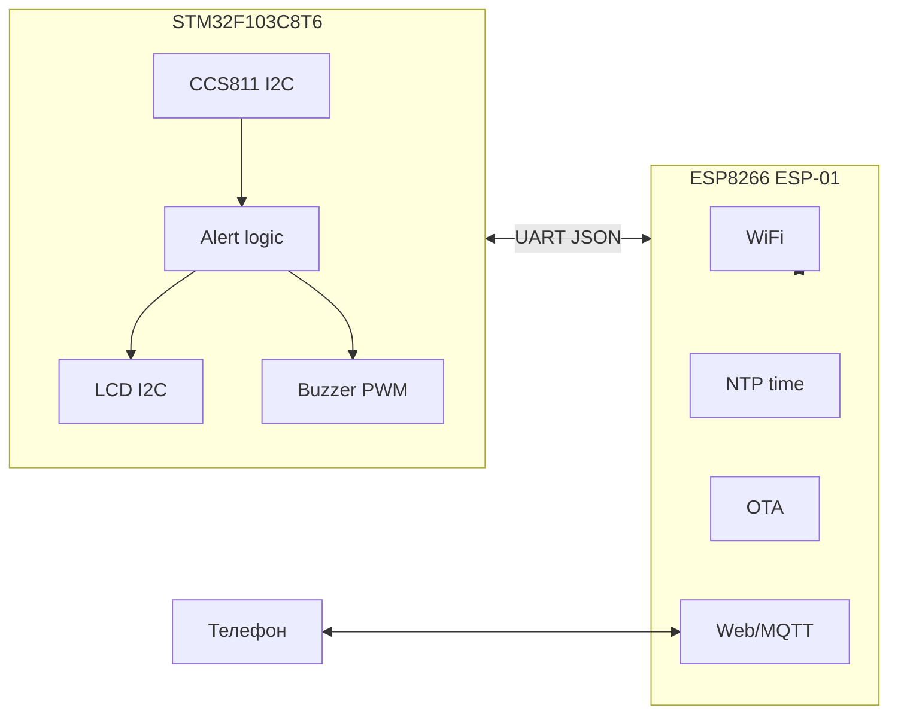
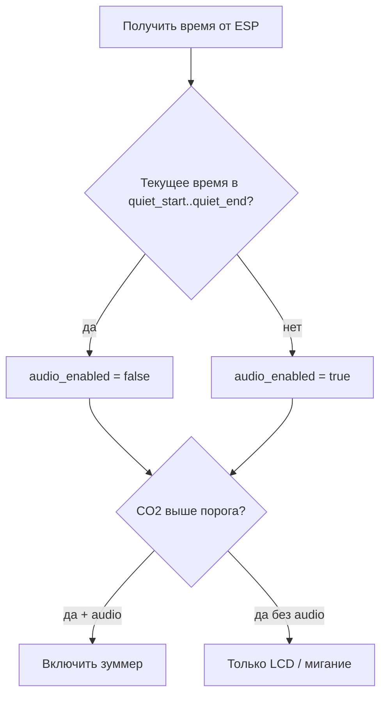

# План: устройство измерения CO2

## Архитектура

Двухпроцессорная схема: **STM32** — «мозг» (датчик, дисплей, звук, логика тревог); **ESP8266 (ESP-01)** — WiFi, время (NTP), OTA, связь с телефоном.



**Почему так:** STM32 надёжно держит I2C и PWM; ESP8266 уже имеет стек WiFi, OTA и веб-сервер — не нужно тащить всё на STM32.

---

## Рекомендации по компонентам (если ещё не выбраны)

| Компонент | Рекомендация | Причина |
|-----------|--------------|---------|
| LCD | **I2C OLED 128×64 (SSD1306)** | 2 пина I2C, читаемый CO2 + статус WiFi |
| Звук | **Пьезо-зуммер** (не динамик) | Простой PWM, меньше места и схемы |
| Время | **NTP на ESP8266** → передача на STM32 | Не нужен отдельный RTC (DS3231 опционально при отключённом WiFi) |
| Телефон | **Веб-интерфейс на ESP8266** + опционально MQTT | Без своего приложения; настройка тихих часов в браузере |

Опционально: **BME280** на той же I2C-шине — CCS811 точнее при реальной температуре/влажности (компенсация в драйвере).

---

## Аппаратная часть

### Подключение (STM32F103C8T6)

| Устройство | Интерфейс | Пины (пример) |
|------------|-----------|---------------|
| CCS811 | I2C1 | SCL `PB6`, SDA `PB7` |
| SSD1306 | I2C1 (общая шина) | те же |
| ESP-01 | UART1 | TX `PA9` → RX ESP, RX `PA10` ← TX ESP |
| Зуммер | TIM PWM | `PA8` или любой GPIO + PWM |
| Кнопка (опц.) | GPIO | `PB0` — mute / сброс baseline |

**Важно:**
- ESP-01 только **3.3 V**; линия CH_PD/EN должна быть на HIGH.
- CCS811: адрес `0x5A`, нужен стабильный 3.3 V и развязывающий конденсатор у датчика.
- Общая I2C-шина: разные адреса (CCS811 `0x5A`, SSD1306 `0x3C`).
- Питание: USB 5 V → стабилизатор 3.3 V (ESP + STM32 + датчик).

### ESP8266 прошивка

Не AT-команды, а **кастомная прошивка** (Arduino/PlatformIO на ESP8266):
- WiFiManager или сохранённые credentials в SPIFFS
- NTP (часовой пояс в настройках)
- AsyncWebServer: `/api/co2`, `/api/settings`, `/api/ota`
- UART-протокол с STM32 (JSON-линии, 115200 baud)

OTA: **сначала ESP8266** (стандартный Arduino OTA); прошивка STM32 — через UART с ESP (esptool-стиль или свой bootloader) — можно добавить во 2-й этап.

---

## Логика программы

### STM32 (основной цикл)

1. Инициализация I2C, CCS811 (режим 1 s / 10 s — настраиваемо), LCD, UART, PWM зуммера.
2. Чтение eCO2 каждые N секунд; фильтр (медиана 3–5 значений) для стабильности.
3. Обновление LCD: CO2 (ppm), уровень (норма/повышен/опасно), иконка WiFi/тихий режим.
4. **Тревоги по уровню CO2** (примерные пороги, настраиваемые):
   - &lt; 800 ppm — норма, без звука
   - 800–1200 ppm — жёлтый, короткий сигнал раз в 5 мин
   - &gt; 1200 ppm — красный, периодический сигнал
5. **Тихие часи (ночь):** звук **полностью отключён**, LCD и тревоги визуально работают.

### Тихие часи — логика



- Параметры в SPIFFS на ESP: `quiet_start` (например `22:00`), `quiet_end` (`07:00`), `timezone` (`UTC+3`).
- ESP раз в минуту (или по запросу STM32) шлёт: `{"time":"07:30","quiet":true}`.
- Переход через полночь: `22:00–07:00` — если `hour >= start OR hour < end`.
- Ручной mute с кнопки на STM32: до следующего утра или до сброса.

### UART-протокол (JSON, newline)

**STM32 → ESP:** `{"co2":850,"tvoc":120,"alert":1}`  
**ESP → STM32:** `{"time":"22:15","quiet":true,"co2_warn":800,"co2_crit":1200}`

Настройки порогов и тихих часов меняются через веб с телефона → ESP сохраняет → передаёт STM32.

---

## Взаимодействие с телефоном

**Веб-UI на ESP8266** (страница в локальной сети):

- Текущий CO2 / TVOC (live, WebSocket или polling)
- Настройка: WiFi (при первом запуске), пороги CO2, тихие часи, часовой пояс
- Кнопка «тест звука» (игнорирует тихие часи — для проверки)
- Статус: WiFi, uptime, версия прошивки

Доступ с телефона: `http://co2-sensor.local` (mDNS) или IP из роутера.

**Опционально (этап 2):** MQTT publish для Home Assistant.

---

## Структура репозитория

```
CO2-sensor/
├── stm32/                    # PlatformIO или STM32CubeIDE
│   ├── src/
│   │   ├── main.c
│   │   ├── ccs811.c
│   │   ├── ssd1306.c
│   │   ├── buzzer.c
│   │   ├── uart_protocol.c
│   │   └── alert_logic.c
│   └── platformio.ini
├── esp8266/                  # PlatformIO
│   ├── src/
│   │   ├── main.cpp
│   │   ├── wifi_manager.cpp
│   │   ├── web_server.cpp
│   │   ├── ntp_time.cpp
│   │   └── uart_bridge.cpp
│   └── platformio.ini
├── docs/
│   ├── wiring.md             # схема подключения
│   └── uart_protocol.md
└── README.md
```

---

## Этапы реализации

### Этап 1 — «железо работает»
- Прошивка STM32: CCS811 + OLED, отображение CO2
- Проверка I2C, baseline CCS811 (20 мин в помещении)

### Этап 2 — звук и тревоги
- PWM зуммер, пороги, визуальные уровни на LCD
- Локальная логика тревог без WiFi (тихие часи по умолчанию 22:00–07:00 из EEPROM STM32)

### Этап 3 — ESP8266 и UART
- Прошивка ESP: WiFi, NTP, UART bridge
- STM32 получает время и `quiet` с ESP
- Синхронизация настроек

### Этап 4 — телефон и OTA
- Веб-интерфейс, сохранение настроек
- OTA для ESP8266
- Документация wiring

### Этап 5 (опц.)
- OTA STM32 через ESP
- MQTT / Home Assistant
- BME280 для компенсации CCS811

---

## Риски и замечания

- **CCS811:** измеряет eCO2 (оценка), не NDIR; для «комнатного» мониторинга обычно достаточно; калибровка baseline важна.
- **ESP-01:** мало GPIO, но для UART-only достаточно; прошивка через USB-UART с переводом в flash mode.
- **Динамик vs зуммер:** динамик требует усилителя (PAM8302) и DAC/PWM с фильтром — сложнее; зуммер покрывает задачу «звукового сигнала».
- **Без WiFi:** тихие часа работают из EEPROM на STM32; время без NTP неточно — RTC DS3231 как fallback.
