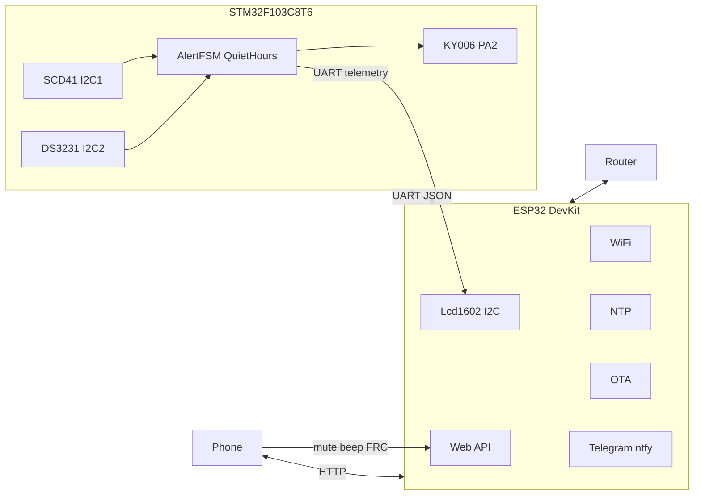
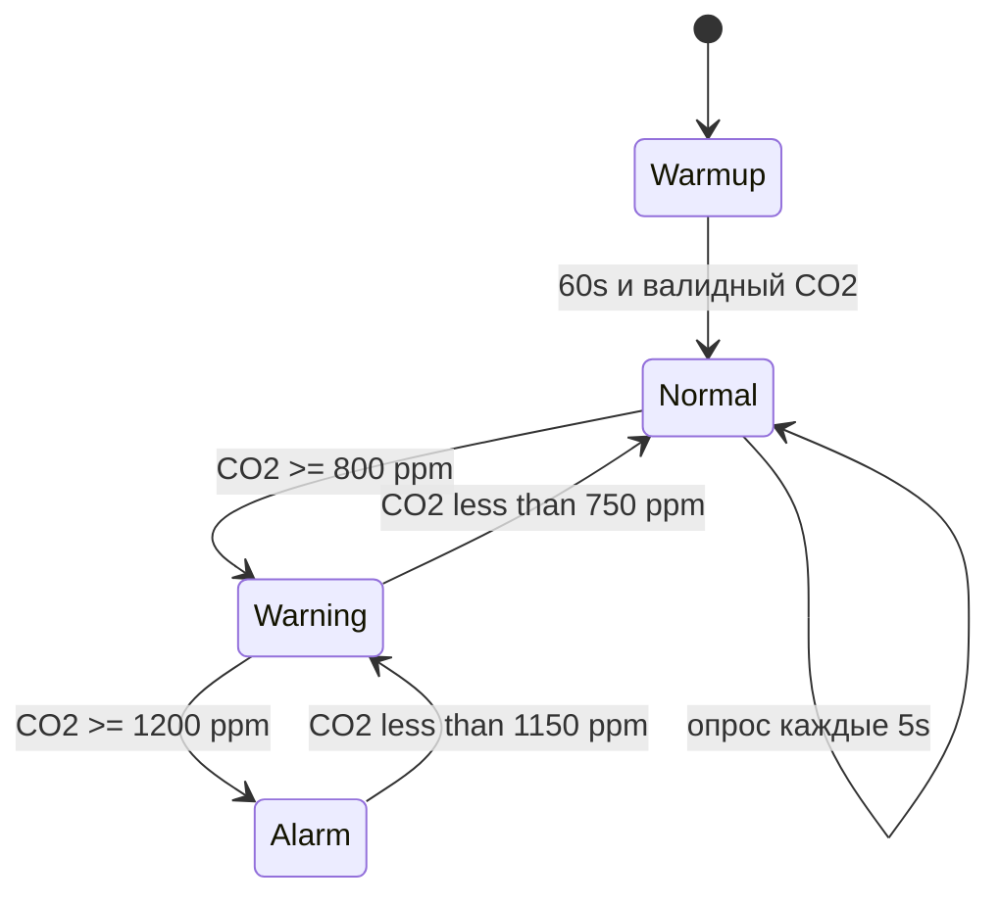

# CO2 Sensor — итоговый план проекта

Комнатный монитор **CO2** (NDIR) на **STM32F103C8T6** + **ESP32 DevKit**.  
Датчик: **SCD41**. Дисплей: **LCD 1602 I2C на ESP32**. RTC: **DS3231**. Зуммер: **KY-006 (HW-508)**.  
Управление с **HTML-страницы** (кнопки на плате нет). Звук отключается в **тихие часы** (22:00–07:00).

> Архивные черновики: [`.cursor/plans/`](.cursor/plans/)

---

## Итоговая конфигурация

| Параметр | Решение |
|----------|---------|
| Датчик CO2 | **Sensirion SCD41** (NDIR) — CO2, T, RH |
| Дисплей | **LCD 1602** + **PCF8574**, I2C **на ESP32** |
| МК «железа» | **STM32F103C8T6** (Blue Pill) |
| WiFi / веб | **ESP32 DevKit** (30 pin) |
| Часы | **DS3231** + CR2032 на отдельной I2C STM32 |
| Зуммер | **KY-006 (HW-508)** — пассивный, PWM на **PA2** |
| Кнопка | **нет** — mute, beep, калибровка с веб-страницы |
| BME280 | **не используется** |
| Телефон | Локальный веб + JSON API; опционально Telegram / ntfy |
| Тихие часы | 22:00–07:00, звук off, LCD работает |

---

## Архитектура



**STM32** — автономное ядро: опрос SCD41 (I2C1), DS3231 (I2C2), зуммер, пороги, тихие часы.  
**ESP32** — LCD, WiFi, веб-управление, API, NTP → sync DS3231, OTA, уведомления.

LCD обновляется из телеметрии UART. Без ESP32 дисплей не работает; STM32 продолжает измерять и пищать по DS3231.

---

## Принятое подключение

| Связь | Шина / пин | Хост |
|-------|------------|------|
| STM32 ↔ ESP32 | UART | USART1 ↔ UART2 |
| SCD41 | I2C1 **PB6 SCL / PB7 SDA** | STM32 |
| DS3231 | I2C2 **PB10 SCL / PB11 SDA** | STM32 |
| Зуммер KY-006 | **PA2** (TIM2_CH3 PWM) | STM32 |
| LCD 1602 | I2C **GPIO21 SDA / GPIO22 SCL** | ESP32 |

---

## Полный список компонентов (BOM)

### Обязательные

| № | Компонент | Модель / тип | Кол-во | Назначение |
|---|-----------|--------------|--------|------------|
| 1 | Микроконтроллер | STM32F103C8T6 (Blue Pill) | 1 | SCD41, DS3231, зуммер, UART |
| 2 | WiFi-модуль | ESP32 DevKit v1 (30 pin) | 1 | LCD, WiFi, веб, NTP, OTA |
| 3 | Датчик CO2 | Sensirion **SCD41** (модуль I2C) | 1 | CO2 ppm, T, RH |
| 4 | Дисплей | **LCD 1602** + backpack **PCF8574** (I2C) | 1 | 2 строки текста (на ESP32) |
| 5 | Часы реального времени | **DS3231** + батарея **CR2032** | 1 | Время, тихие часы без WiFi |
| 6 | Зуммер | **KY-006 (HW-508)** пассивный модуль | 1 | PWM-тон, тревога |
| 7 | Стабилизатор | AMS1117-3.3 (модуль **≥ 1 A**) | 1 | Общая шина 3.3 V |
| 8 | Блок питания | USB 5 V **≥ 1 A** | 1 | Питание устройства |
| 9 | Конденсатор | 10 µF электролит | 2 | Cin/Cout LDO |
| 10 | Конденсатор | 100 nF керамика | 8–10 | Развязка VCC–GND у модулей |
| 11 | Резистор | 4.7 kΩ | 6 | Подтяжки трёх I2C-шин (по 2 шт.) |
| 12 | Резистор | 100 Ω | 1 | Между PA2 и SIG зуммера |
| 13 | Монтаж | Breadboard / perfboard, Dupont | 1 компл. | Сборка |

Кнопки на плате **нет**.

### Корпус

| № | Компонент | Кол-во | Примечание |
|---|-----------|--------|------------|
| 14 | Корпус с отверстиями | 1 | Вентиляция для SCD41 |
| 15 | Стойки, винты M3 | комплект | Крепление плат |

### Инструменты

- ST-Link или USB-UART — прошивка STM32
- USB-кабель — прошивка ESP32 DevKit
- Мультиметр

---

## Электрическая схема

### 1. Питание

```
                         ┌──────────────────────────────────────┐
  USB +5V (≥1A) ────────┤  F1 (опц. 1A)                       │
                         │         ┌─────────┐                  │
                         └─────────┤ AMS1117 ├──── +3V3 (шина)  │
                                   │  -3.3   │                  │
                         GND ──────┤  GND    │                  │
                                   └────┬────┘                  │
                                   10µF │ 10µF                  │
                                   (in)│(out)                   │
                                        │                        │
    ┌───────────┬───────────┬───────────┼───────────┬───────────┐
    │           │           │           │           │           │
  STM32       SCD41      DS3231      KY-006      LCD1602     ESP32
  3.3V        VCC        VCC         VCC (+)     VCC         pin 3V3
  GND         GND        GND         GND (-)     GND         GND
```

**Правила питания**

- Одна общая шина **+3.3 V** и **GND**.
- **SCD41**, **DS3231**, **ESP32 pin 3V3** — только 3.3 V.
- LCD backpack: 3.3 V, либо VCC от 5 V rail при общей GND (если модуль только 5 V).
- LDO **≥ 1 A**: ESP32 WiFi + SCD41 + подсветка LCD — пики ~600–700 mA.
- 100 nF между VCC и GND у каждого модуля.

---

### 2. I2C1 STM32 — только SCD41 (PB6 / PB7)

```
                    +3.3V
                      │
                   [4.7k] [4.7k]
                      │     │
         STM32 PB6 ───┴─────┴──── SCL ──── SCD41 SCL
         STM32 PB7 ────────────── SDA ──── SCD41 SDA
```

| Pin SCD41 | STM32 |
|-----------|-------|
| VCC | +3.3 V |
| GND | GND |
| SCL | **PB6** (I2C1_SCL) |
| SDA | **PB7** (I2C1_SDA) |

Адрес SCD41: **0x62**. Частота: 100 kHz.

---

### 3. I2C2 STM32 — только DS3231 (PB10 / PB11)

```
                    +3.3V
                      │
                   [4.7k] [4.7k]
                      │     │
         STM32 PB10 ──┴─────┴──── SCL ──── DS3231 SCL
         STM32 PB11 ───────────── SDA ──── DS3231 SDA
```

| Pin DS3231 | STM32 |
|------------|-------|
| VCC | +3.3 V |
| GND | GND |
| SCL | **PB10** (I2C2_SCL) |
| SDA | **PB11** (I2C2_SDA) |
| CR2032 | В держатель модуля |

Адрес DS3231: **0x68**.

**Зачем две шины:** SCD41 и DS3231 разведены, чтобы длинный/шумный датчик не мешал RTC.

---

### 4. I2C ESP32 — только LCD 1602

```
                    +3.3V
                      │
                   [4.7k] [4.7k]
                      │     │
         ESP32 GPIO22 ─┴─────┴──── SCL ──── LCD SCL (PCF8574)
         ESP32 GPIO21 ──────────── SDA ──── LCD SDA (PCF8574)
```

| Pin backpack | ESP32 |
|--------------|-------|
| VCC | +3.3 V (или +5 V, GND общий) |
| GND | GND |
| SCL | **GPIO22** |
| SDA | **GPIO21** |

Адрес PCF8574: **0x27** или **0x3F**.

Пины GPIO21/GPIO22 — стандарт I2C на DevKit. Если на плате другие — указать в коде.

---

### 5. UART STM32 ↔ ESP32

```
  STM32 PA9  (USART1_TX) ──────────────► ESP32 GPIO16 или GPIO25 (RX)
  STM32 PA10 (USART1_RX) ◄──────────────  ESP32 GPIO17 или GPIO26 (TX)
  GND ─────────────────────────────────── GND
```

| Параметр | Значение |
|----------|----------|
| Скорость | 115200 baud, 8N1 |
| Уровни | 3.3 V TTL |

Не вешать UART на ESP32 GPIO0, GPIO2, GPIO12 (strapping).

---

### 6. Зуммер KY-006 (HW-508) — PA2

```
         +3.3V
            │
            ├──► KY-006  (+)  VCC
            │
  PA2 ──[100Ω]──► KY-006  (S)  SIG     TIM2_CH3, PWM ~2–4 kHz
            │
           GND ──► KY-006  (-)  GND
```

| Pin KY-006 | Подключение |
|------------|-------------|
| **+** (VCC) | +3.3 V |
| **S** (SIG) | **PA2** через 100 Ω |
| **−** (GND) | GND |

- Пассивный модуль, транзистор не нужен.
- Warning: beep 200 ms / 5 мин. Alarm: 3× beep / 30 с.
- Тихие часы и mute с веба: PWM на PA2 = 0 %.

---

### 7. Сводная таблица пинов

**STM32F103C8T6**

```
PA2  — KY-006 SIG (TIM2_CH3 PWM)
PA9  — USART1 TX → ESP32 GPIO16 или GPIO25
PA10 — USART1 RX ← ESP32 GPIO17 или GPIO26
PB6  — I2C1 SCL  → SCD41
PB7  — I2C1 SDA  → SCD41
PB10 — I2C2 SCL  → DS3231
PB11 — I2C2 SDA  → DS3231
```

**ESP32 DevKit**

```
GPIO16 — UART RX2 ← STM32 PA9 (на WROVER не использовать)
GPIO17 — UART TX2 → STM32 PA10
GPIO25 — запасной UART RX ← STM32 PA9
GPIO26 — запасной UART TX → STM32 PA10
GPIO21 — I2C SDA  → LCD 1602
GPIO22 — I2C SCL  → LCD 1602
3V3 / GND — общая шина питания
```

---

### 8. Полная однолинейная схема

```
  [USB 5V]──[AMS1117-3.3]──+3V3──┬──STM32──┬──SCD41──┬──DS3231──┬──KY-006──┬──LCD1602──┬──ESP32
                              │         │         │          │          │           │
                             GND───────GND───────GND────────GND────────GND─────────GND

  STM32 PB6 / PB7   ════ I2C1 ════ SCD41
  STM32 PB10 / PB11 ════ I2C2 ════ DS3231
  ESP32 GPIO21 / 22 ════ I2C  ════ LCD 1602 (PCF8574)

  STM32 PA9 / PA10  ←── UART 115200 ──→ ESP32 GPIO16/17 или GPIO25/26

  STM32 PA2 ──[100Ω]── KY-006(S)     KY-006(+)── +3V3    KY-006(-)── GND
```

---

## LCD — формат строк (рисует ESP32)

| Строка | Normal | Warning / Alarm |
|--------|--------|-----------------|
| 1 | `CO2: 845 ppm  [OK]` | `CO2: 1050 ppm [WARN]` / `[ALARM]` |
| 2 | `23.1C  45%  22:15` | `!! OPEN WINDOW !!` или время + RH |

Источник данных: JSON телеметрия STM32. Обновление раз в **1–2 с**.  
Нет пакета UART &gt; 10 с: `NO STM32 LINK`.  
Прогрев: `Warming...` пока `alert` не станет валидным / CO2 = 0.

---

## Управление с веб-страницы (вместо кнопки)

Питание физически всегда есть (USB). С HTML:

| Действие | API | UART на STM32 |
|----------|-----|----------------|
| Mute звука на 60 мин | `POST /api/mute` | `{"cmd":"mute","minutes":60}` |
| Снять mute | `POST /api/unmute` | `{"cmd":"unmute"}` |
| Тест зуммера | `POST /api/beep` | `{"cmd":"beep"}` |
| Тревоги вкл/выкл | `POST /api/settings` | `{"cmd":"set_alerts","enabled":true}` |
| Калибровка SCD41 FRC | `POST /api/calibrate` | `{"cmd":"frc_calibrate"}` |
| Пороги и тихие часы | `POST /api/settings` | пакет настроек |

Первый WiFi: WiFiManager AP `CO2-Setup` — кнопка не нужна.

---

## Логика и пороги

### FSM (на STM32)



| Уровень | CO2 (ppm) | LCD | Звук (не quiet, не mute) |
|---------|-----------|-----|--------------------------|
| Normal | &lt; 800 | `[OK]` | нет |
| Warning | 800–1200 | `[WARN]` | 1 beep / 5 мин |
| Alarm | &gt; 1200 | `[ALARM]` | 3 beep / 30 с |

- Гистерезис: **50 ppm**.
- Прогрев SCD41: **~60 s**.

### Тихие часы

- По умолчанию: **22:00 – 07:00**.
- Время: **DS3231** на STM32; NTP ESP32 → UART `set_time` → DS3231, раз в 24 ч.
- Ночью: звук off, LCD on (мигание при Alarm).
- Настройки: ESP32 SPIFFS → UART → flash STM32.

---

## UART-протокол (кратко)

Подробно: [`docs/uart_protocol.md`](docs/uart_protocol.md)

**STM32 → ESP32** (каждые 5 s, ESP32 пишет на LCD):
```json
{"co2":845,"temp":23.1,"rh":45,"alert":1,"quiet":false,"time":"22:15"}
```

**ESP32 → STM32**:
```json
{"co2_warn":800,"co2_crit":1200,"quiet_start":22,"quiet_end":7,"epoch":1719320000}
{"cmd":"beep"}
{"cmd":"mute","minutes":60}
{"cmd":"set_time","epoch":1719320000}
{"cmd":"frc_calibrate"}
```

---

## JSON API (ESP32, v1)

| Метод | URL | Назначение |
|-------|-----|------------|
| GET | `/` | Веб-страница: CO2, T, RH, mute, калибровка |
| GET | `/api/status` | Значения + alert + quiet + mute + WiFi |
| GET | `/api/settings` | Пороги, quiet hours, timezone |
| POST | `/api/settings` | Сохранить настройки |
| POST | `/api/beep` | Тест KY-006 |
| POST | `/api/mute` | Mute на 60 мин |
| POST | `/api/unmute` | Снять mute |
| POST | `/api/calibrate` | FRC SCD41 (с подтверждением в UI) |
| POST | `/update` | OTA ESP32 |

---

## Структура репозитория

```
CO2 sensor/
├── stm32_cube/co2_stm32/     CubeIDE: Core/ прикладной код, Drivers/ HAL
├── esp32/                    PlatformIO: src/ + include/
├── docs/
│   ├── code/                 документация прошивок
│   ├── wiring.md
│   ├── uart_protocol.md
│   └── cubemx.md
├── PLAN.md
└── README.md
```

Разбор файлов: [`docs/code/README.md`](docs/code/README.md).

---

## Этапы реализации

| Этап | Задачи |
|------|--------|
| **1** | Breadboard: SCD41 на I2C1 STM32, UART лог CO2/T/RH |
| **2** | DS3231 на I2C2, KY-006 на PA2, FSM и тихие часы |
| **3** | ESP32: UART JSON, LCD на GPIO21/22, NTP → `set_time` |
| **4** | Веб-UI: mute/beep/калибровка, API, OTA, Telegram/ntfy |
| **5** | Корпус; FRC SCD41 с веба (400 ppm, свежий воздух) |

---

## Риски

| Риск | Митигация |
|------|-----------|
| Просадка 3.3 V при WiFi | LDO ≥ 1 A, 100 nF у ESP32 и SCD41 |
| LCD молчит без ESP32 | Ожидаемо: дисплей на ESP32; STM32 автономен по звуку |
| Нет WiFi | DS3231 + flash STM32; LCD/веб недоступны до появления сети |
| I2C-конфликт | Три отдельные шины — конфликтов адресов между хостами нет |
| OTA STM32 сложен | v1: OTA только ESP32; STM32 — USB/ST-Link |
| Калибровка с веба | Кнопка FRC только с подтверждением; не жать в комнате |

---

## Связанные документы

| Файл | Описание |
|------|----------|
| [`docs/wiring.md`](docs/wiring.md) | Монтаж и проверка |
| [`docs/uart_protocol.md`](docs/uart_protocol.md) | UART JSON |
| [`docs/code/README.md`](docs/code/README.md) | Модули STM32 / ESP32, циклы, API |
| [`docs/cubemx.md`](docs/cubemx.md) | CubeMX / HAL шпаргалка |
| [`.cursor/plans/`](.cursor/plans/) | Архивные черновики |
