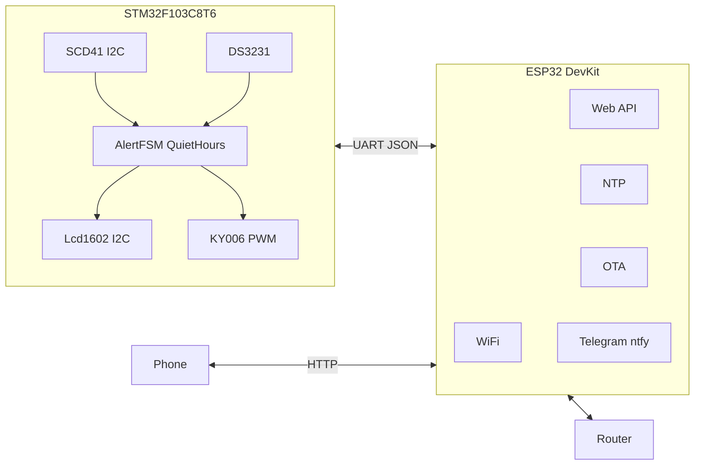
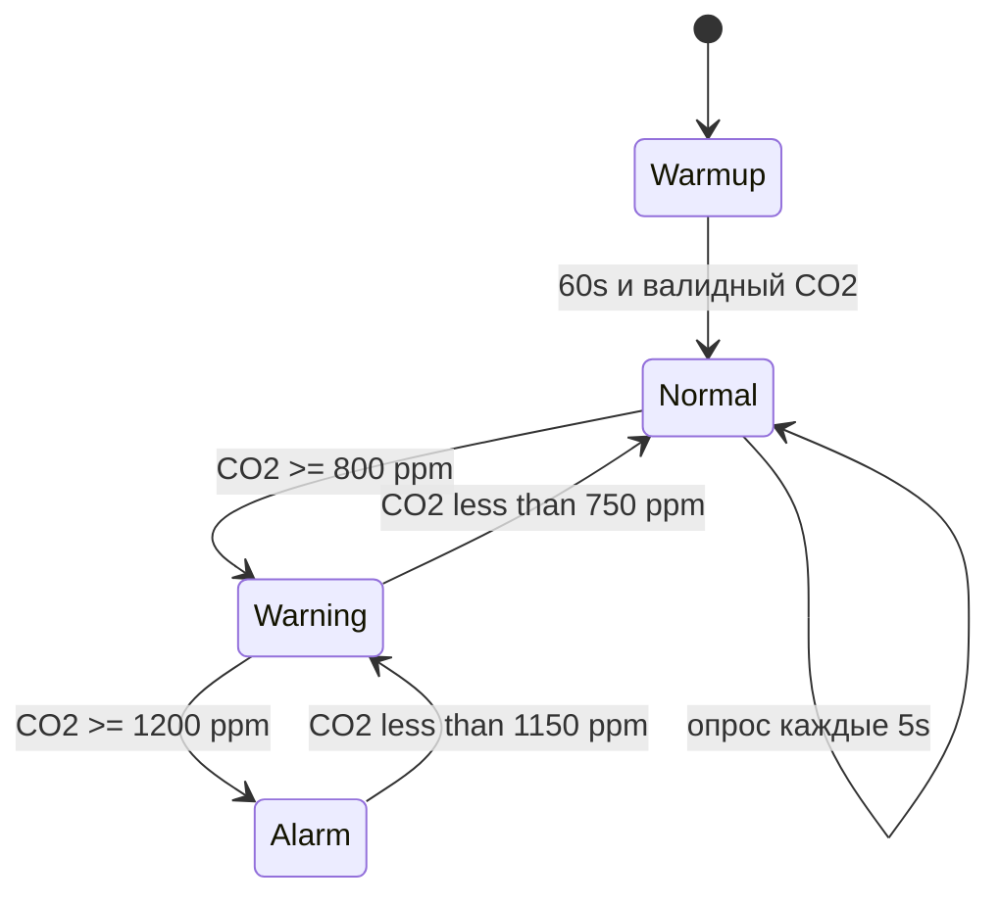

# CO2 Sensor — итоговый план проекта

Комнатный монитор **CO2** (NDIR) на **STM32F103C8T6** + **ESP32 DevKit**.  
Датчик: **SCD41**. Дисплей: **LCD 1602 I2C**. RTC: **DS3231**. Зуммер: **KY-006 (HW-508)**.  
Звук отключается в **тихие часы** (22:00–07:00).

> Архивные черновики: [`.cursor/plans/`](.cursor/plans/)

---

## Итоговая конфигурация

| Параметр | Решение |
|----------|---------|
| Датчик CO2 | **Sensirion SCD41** (NDIR, I2C) — CO2, T, RH |
| Дисплей | **LCD 1602** + I2C-adapter **PCF8574** |
| МК «железа» | **STM32F103C8T6** (Blue Pill) |
| WiFi / веб | **ESP32 DevKit** (30 pin) |
| Часы | **DS3231** + CR2032; синхронизация NTP через ESP32 |
| Зуммер | **KY-006 (HW-508)** — пассивный, PWM |
| BME280 | **не используется** |
| Телефон | Локальный веб + JSON API; опционально Telegram / ntfy |
| Тихие часы | 22:00–07:00, звук off, LCD работает |

---

## Архитектура



**STM32** — автономное ядро: опрос SCD41, LCD, зуммер, DS3231, пороги, тихие часы.  
**ESP32** — сеть: WiFi, веб, API, NTP → sync DS3231, OTA, уведомления.

---

## Полный список компонентов (BOM)

### Обязательные

| № | Компонент | Модель / тип | Кол-во | Назначение |
|---|-----------|--------------|--------|------------|
| 1 | Микроконтроллер | STM32F103C8T6 (Blue Pill) | 1 | Датчик, LCD, звук, RTC, UART |
| 2 | WiFi-модуль | ESP32 DevKit v1 (30 pin) | 1 | WiFi, веб, NTP, OTA |
| 3 | Датчик CO2 | Sensirion **SCD41** (модуль I2C) | 1 | CO2 ppm, T, RH |
| 4 | Дисплей | **LCD 1602** + backpack **PCF8574** (I2C) | 1 | 2 строки текста |
| 5 | Часы реального времени | **DS3231** + батарея **CR2032** | 1 | Время, тихие часы без WiFi |
| 6 | Зуммер | **KY-006 (HW-508)** пассивный модуль | 1 | PWM-тон, тревога |
| 7 | Стабилизатор | AMS1117-3.3 (модуль **≥ 1 A**) | 1 | Общая шина 3.3 V |
| 8 | Блок питания | USB 5 V **≥ 1 A** (Micro-USB) | 1 | Питание устройства |
| 9 | Конденсатор | 10 µF электролит | 2 | Cin/Cout LDO |
| 10 | Конденсатор | 100 nF керамика | 8–10 | Развязка VCC–GND у модулей |
| 11 | Резистор | 4.7 kΩ | 2 | Подтяжка I2C SCL/SDA |
| 12 | Резистор | 100 Ω | 1 | Между PA8 и SIG зуммера (рекомендуется) |
| 13 | Кнопка | Тактовая NO | 1 | Mute звука |
| 14 | Монтаж | Breadboard / perfboard, Dupont | 1 компл. | Сборка |

### Корпус

| № | Компонент | Кол-во | Примечание |
|---|-----------|--------|------------|
| 15 | Корпус с отверстиями | 1 | Вентиляция для SCD41 (CO2 должен циркулировать) |
| 16 | Стойки, винты M3 | комплект | Крепление плат |

### Инструменты

- ST-Link или USB-UART — прошивка STM32  
- USB-кабель — прошивка ESP32 DevKit  
- Мультиметр  

---

## Электрическая схема

### 1. Питание

```
                         ┌──────────────────────────────────────┐
  USB +5V (≥1A) ────────┤  F1 (опц. 1A)                       │
                         │         ┌─────────┐                  │
                         └─────────┤ AMS1117 ├──── +3V3 (шина)  │
                                   │  -3.3   │                  │
                         GND ──────┤  GND    │                  │
                                   └────┬────┘                  │
                                   10µF │ 10µF                  │
                                   (in)│(out)                   │
                                        │                        │
    ┌───────────┬───────────┬───────────┼───────────┬───────────┐
    │           │           │           │           │           │
  STM32       SCD41      LCD1602     DS3231      KY-006      ESP32
  3.3V        VCC        VCC         VCC         VCC (+)     pin 3V3
  GND         GND        GND         GND         GND (-)     GND
```

**Правила питания**

- Одна общая шина **+3.3 V** и **GND** для всех модулей.
- **SCD41**, **DS3231**, **PCF8574**, **ESP32 pin 3V3** — только 3.3 V.
- LDO **≥ 1 A**: ESP32 WiFi + SCD41 + подсветка LCD дают пики до ~600–700 mA.
- 100 nF между VCC и GND **у каждого модуля**, максимально близко к выводам.
- ESP32 DevKit можно питать от той же шины 3.3 V (pin **3V3**) **или** от отдельного USB 5 V (pin **VIN**) — при общей **GND**.

---

### 2. I2C-шина (все датчики и LCD)

```
                    +3.3V
                      │
                   [4.7k] [4.7k]        ← подтяжки SCL, SDA (если нет на модулях)
                      │     │
         STM32 PB6 ───┴─────┴──── SCL ───┬──── SCD41 SCL
                                          ├──── LCD SCL (PCF8574)
                                          └──── DS3231 SCL

         STM32 PB7 ───────────────── SDA ───┬──── SCD41 SDA
                                              ├──── LCD SDA (PCF8574)
                                              └──── DS3231 SDA
```

| Устройство | I2C-адрес | Примечание |
|------------|-----------|------------|
| SCD41 | **0x62** | SEL → GND (0x62) или VCC (0x63) |
| LCD 1602 + PCF8574 | **0x27** или **0x3F** | Зависит от перемычек на модуле |
| DS3231 | **0x68** | Стандартный адрес модуля |

- Частота I2C: **100 kHz** (старт), можно 400 kHz после отладки.
- Длина проводов I2C на breadboard: **&lt; 20 cm**.

#### SCD41 (типовой 4-pin модуль)

| Pin модуля | Подключение |
|------------|-------------|
| VCC | +3.3 V |
| GND | GND |
| SCL | I2C SCL |
| SDA | I2C SDA |

Pin **RDY** (если есть) — не подключать или на GPIO STM32 (опционально, v2).

---

### 3. UART STM32 ↔ ESP32

```
  STM32 PA9  (USART1_TX) ──────────────► ESP32 GPIO16 (RX2)
  STM32 PA10 (USART1_RX) ◄──────────────  ESP32 GPIO17 (TX2)
  GND ─────────────────────────────────── GND
```

| Параметр | Значение |
|----------|----------|
| Скорость | 115200 baud, 8N1 |
| Уровни | 3.3 V TTL |
| Макс. длина кабеля | &lt; 30 cm на макетке |

**Не использовать** для UART: ESP32 GPIO0, GPIO2, GPIO12 (strapping при boot).

---

### 4. Зуммер KY-006 (HW-508)

Пассивный пьезо-модуль на 3 pin:

```
         +3.3V
            │
            ├──► KY-006  (+)  VCC
            │
  PA8 ──[100Ω]──► KY-006  (S)  SIG     TIM1_CH1, PWM ~2–4 kHz
            │
           GND ──► KY-006  (-)  GND
```

| Pin KY-006 | Подключение |
|------------|-------------|
| **+** (VCC) | +3.3 V |
| **S** (SIG) | PA8 через 100 Ω |
| **−** (GND) | GND |

- Транзистор **не нужен** — модуль пассивный, управление **PWM-тоном**.
- Warning: короткий beep 200 ms, 2 kHz. Alarm: 3× beep каждые 30 s.
- В **тихие часы** PWM на PA8 = 0 %.

---

### 5. Кнопка MUTE

```
  +3.3V (внутр. pull-up STM32)

  PB0 ────┬──── [Кнопка] ──── GND
          │
     (INPUT_PULLUP)
```

| Действие | Результат |
|----------|-----------|
| Короткое нажатие | Mute звука на **60 мин** |
| Длинное (&gt; 3 s) | Запуск **FRC** SCD41 (калибровка 400 ppm, см. этап 5) |

---

### 6. DS3231

| Pin | Подключение |
|-----|-------------|
| VCC | +3.3 V |
| GND | GND |
| SCL | I2C SCL |
| SDA | I2C SDA |
| CR2032 | В держатель модуля (часы при отключении USB) |

---

### 7. LCD 1602 (I2C backpack PCF8574)

| Pin backpack | Подключение |
|--------------|-------------|
| VCC | +3.3 V (или 5 V, если модуль только 5 V — тогда отдельно от 5 V rail, I2C через level-safe) |
| GND | GND |
| SCL | I2C SCL |
| SDA | I2C SDA |

**Примечание:** большинство модулей PCF8574 работают от 3.3–5 V; при питании 5 V логика I2C обычно совместима с STM32 3.3 V. Если сомнения — взять модуль с маркировкой 3.3 V или проверить мультиметром уровень SDA.

---

### 8. Сводная таблица пинов STM32

```
PA8  — KY-006 SIG (TIM1_CH1, PWM)
PA9  — USART1 TX → ESP32 GPIO16
PA10 — USART1 RX ← ESP32 GPIO17
PB0  — Кнопка MUTE
PB6  — I2C1 SCL  → SCD41, LCD, DS3231
PB7  — I2C1 SDA  → SCD41, LCD, DS3231
```

### 9. ESP32 DevKit (минимум)

| Pin | Назначение |
|-----|------------|
| 3V3 | +3.3 V (общая шина) |
| GND | GND |
| GPIO16 | UART RX2 ← STM32 PA9 |
| GPIO17 | UART TX2 → STM32 PA10 |
| EN | HIGH (на плате уже подтянут) |
| VIN / USB | Альтернативное питание 5 V |

---

### 10. Полная однолинейная схема (обзор)

```
  [USB 5V]──[AMS1117-3.3]──+3V3──┬──STM32──┬──SCD41──┬──DS3231──┬──LCD1602──┬──KY-006──┬──ESP32
                              │         │         │          │           │          │
                             GND───────GND───────GND────────GND─────────GND────────GND

  STM32 PB6/PB7 ═════════════ I2C (SCL/SDA) ════════════════════════════════════

  STM32 PA9/PA10 ←────────── UART 115200 ──────────→ ESP32 GPIO16/17

  STM32 PA8 ──[100Ω]── KY-006(S)     KY-006(+)── +3V3    KY-006(-)── GND

  STM32 PB0 ──[Button]── GND
```

---

## LCD — формат строк

| Строка | Normal | Warning / Alarm |
|--------|--------|-----------------|
| 1 | `CO2: 845 ppm  [OK]` | `CO2: 1050 ppm [WARN]` / `[ALARM]` |
| 2 | `23.1C  45%  22:15` | `!! OPEN WINDOW !!` или время + RH |

Обновление: раз в **1–2 с**. При Critical в тихие часы — **мигание** текста строки 1.

---

## Логика и пороги

### FSM



| Уровень | CO2 (ppm) | LCD | Звук (не quiet) |
|---------|-----------|-----|-----------------|
| Normal | &lt; 800 | `[OK]` | нет |
| Warning | 800–1200 | `[WARN]` | 1 beep / 5 мин |
| Alarm | &gt; 1200 | `[ALARM]` | 3 beep / 30 с |

- Гистерезис: **50 ppm**.
- Прогрев SCD41 после включения: **~60 s** (экран `Warming...`).

### Тихие часы

- По умолчанию: **22:00 – 07:00** (Europe/Moscow или timezone из настроек).
- Источник времени: **DS3231**; коррекция **NTP** (ESP32 → UART → STM32 → DS3231) каждые 24 ч.
- Ночью: **звук off**, LCD on, мигание при Alarm.
- Настройки: ESP32 SPIFFS → UART → flash STM32.

---

## UART-протокол (кратко)

Подробно: [`docs/uart_protocol.md`](docs/uart_protocol.md)

**STM32 → ESP32** (каждые 5 s):
```json
{"co2":845,"temp":23.1,"rh":45,"alert":1,"quiet":false}
```

**ESP32 → STM32**:
```json
{"time":"22:15","quiet":true,"co2_warn":800,"co2_crit":1200,"quiet_start":22,"quiet_end":7,"epoch":1719320000}
{"cmd":"beep"}
{"cmd":"set_time","epoch":1719320000}
```

---

## JSON API (ESP32, v1)

| Метод | URL | Назначение |
|-------|-----|------------|
| GET | `/` | Веб-страница (CO2, T, RH, граф) |
| GET | `/api/status` | Текущие значения + alert + WiFi |
| GET | `/api/settings` | Пороги, quiet hours, timezone |
| POST | `/api/settings` | Сохранить настройки |
| POST | `/api/beep` | Тест KY-006 |
| POST | `/update` | OTA ESP32 |

---

## Структура репозитория

```
CO2 sensor/
├── stm32/
│   ├── src/
│   │   ├── main.c
│   │   ├── scd41.c
│   │   ├── lcd_i2c.c
│   │   ├── rtc_ds3231.c
│   │   ├── buzzer.c
│   │   ├── alert_fsm.c
│   │   ├── quiet_hours.c
│   │   └── esp_link.c
│   └── platformio.ini
├── esp32/
│   ├── src/
│   │   ├── main.cpp
│   │   ├── web_server.cpp
│   │   ├── ntp_sync.cpp
│   │   ├── uart_bridge.cpp
│   │   └── ota.cpp
│   └── platformio.ini
├── docs/
│   ├── wiring.md
│   └── uart_protocol.md
├── PLAN.md
└── README.md
```

---

## Этапы реализации

| Этап | Задачи |
|------|--------|
| **1** | Breadboard по схеме; SCD41 + LCD 1602 + DS3231 + STM32; CO2/T/RH на экране |
| **2** | KY-006 PWM, FSM порогов, тихие часы по DS3231 |
| **3** | ESP32: UART JSON, WiFiManager, NTP → sync DS3231 |
| **4** | Веб-UI, API, OTA ESP32, Telegram/ntfy при Alarm |
| **5** | Корпус; **FRC SCD41** (400 ppm, 3 мин на свежем воздухе); финальный монтаж |

---

## Риски

| Риск | Митигация |
|------|-----------|
| Просадка 3.3 V при WiFi | LDO ≥ 1 A, 100 nF у ESP32 и SCD41 |
| SCD41 self-heating | Корпус с отверстиями; T на LCD «для справки» |
| Нет WiFi | DS3231 + CR2032, настройки во flash STM32 |
| I2C-конфликт адресов | Проверить адрес LCD (0x27/0x3F) до пайки |
| OTA STM32 сложен | v1: OTA только ESP32; STM32 — USB/ST-Link |

---

## Связанные документы

| Файл | Описание |
|------|----------|
| [`docs/wiring.md`](docs/wiring.md) | Монтаж и проверка |
| [`docs/uart_protocol.md`](docs/uart_protocol.md) | UART JSON |
| [`.cursor/plans/`](.cursor/plans/) | Архивные черновики |
