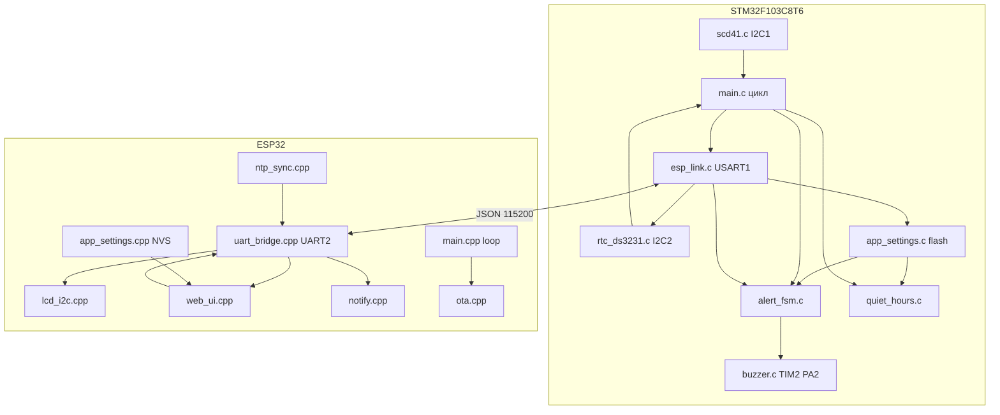

# Архитектура прошивок

Как две платы делят работу, какой цикл крутится на каждой и какие данные ходят по UART.

Определение 1: архитектура (architecture, устройство программы) — это договор «кто за что отвечает»: STM32 измеряет и тревожит, ESP32 показывает и управляет по сети. Если смешать роли (например, считать пороги на ESP32), тихие часы сломаются без Wi‑Fi.

Определение 2: автономность STM32 — свойство ядра: SCD41, DS3231, зуммер и пороги живут на STM32. Обрыв UART гасит LCD и веб, но не измерения и не ночной mute по часам.

Определение 3: телеметрия (telemetry, поток измерений) — JSON-строка STM32 → ESP32 раз в 5 с: CO2, T, RH, уровень тревоги, флаг quiet, время HH:MM. ESP32 только отображает и рассылает, не пересчитывает ppm.

Определение 4: команда (command, управляющий JSON) — строка ESP32 → STM32 с полем `"cmd"`: beep, mute, калибровка. Без `"cmd"` пакет считается настройками (пороги, epoch).

## Разделение ролей



| Задача | Кто | Почему здесь |
|--------|-----|--------------|
| Опрос SCD41 каждые 5 с | STM32 | Датчик на I2C1 этой платы |
| Пороги, гистерезис, warmup | STM32 `alert_fsm` | Звук должен жить без Wi‑Fi |
| Тихие часы 22–07 | STM32 `quiet_hours` + DS3231 | Часы на батарейке |
| PWM зуммера | STM32 TIM2 CH3 | KY-006 на PA2 |
| LCD 1602 | ESP32 | Дисплей физически на GPIO21/22 |
| Веб, mute с телефона | ESP32 → UART cmd | Кнопки на плате нет |
| NTP → DS3231 | ESP32 epoch → STM32 `set_time` | STM32 без Ethernet |
| Telegram / ntfy | ESP32 при входе в Alarm | Нужен Wi‑Fi |
| OTA | только ESP32 | STM32 шьётся ST-Link |

Определение 5: I2C (Inter-Integrated Circuit) — двухпроводная шина адресных чипов. Три независимые шины: STM32 I2C1 = SCD41, STM32 I2C2 = DS3231, ESP32 I2C = LCD. Датчик и часы не делят провода.

Определение 6: UART (Universal Asynchronous Receiver/Transmitter) — последовательный порт TX/RX/GND без отдельного такта. STM32 USART1 PA9/PA10 ↔ ESP32 GPIO16/17 и параллельно GPIO25/26 (запас без PSRAM), 115200 8N1.

Определение 7: JSON (JavaScript Object Notation) — текстовые объекты `{"ключ":значение}`. Одна строка — одно сообщение, конец `\n`. Парсер на обеих сторонах самодельный (strstr / indexOf), не полноценный JSON-движок.

## Главный цикл STM32

Файл: `stm32_cube/co2_stm32/Core/Src/main.c`, зона `USER CODE BEGIN 3`.

Порядок итерации `while (1)`:

1. `esp_link_poll` — разобрать одну готовую UART-строку (настройки или cmd).
2. `esp_link_take_beep` → `buzzer_test_beep(1000)` — тест с веба игнорирует quiet/mute.
3. `esp_link_take_frc` → `scd41_frc_calibrate(400)` и `alert_fsm_reset_warmup`.
4. `ds3231_read` — час/минута для quiet и поля `time` в телеметрии.
5. Раз в `MEASURE_PERIOD_MS` (5 с): `scd41_read` → `alert_fsm_update`.
6. `alert_fsm_process_sound` + `buzzer_poll` — неблокирующие писки.
7. Раз в `TELEMETRY_PERIOD_MS` (5 с): `esp_link_send_telemetry`.

Определение 8: главный цикл (main loop, суперцикл) — бесконечный `while` без RTOS: все задачи по очереди, задержки только внутри драйверов I2C. `buzzer_poll` обязан вызываться часто, иначе тройной alarm-писк слипнется.

Определение 9: HAL_GetTick (Hardware Abstraction Layer millisecond tick) — счётчик миллисекунд от SysTick. Им заведены периоды измерения, mute и интервалы писков. Переполнение ~49 суток; сравнение через `(int32_t)(now - deadline)` это учитывает.

## Главный цикл ESP32

Файлы: `esp32/src/main.cpp` — `setup()` один раз, `loop()` постоянно.

`setup()`: загрузка NVS → LCD → UART2 → WiFiManager AP `CO2-Setup` → mDNS `co2-sensor.local` → NTP, OTA, веб → первая отправка настроек на STM32.

`loop()`:

1. `ota_poll` / `web_poll` — не блокировать надолго.
2. `uart_bridge_poll` — разобрать телеметрию.
3. Раз в 1 с — перерисовать LCD.
4. `notify_on_alert` — одно сообщение при переходе в Alarm.
5. Раз в 60 с — повторно слать настройки + epoch.
6. Раз в 24 ч — заново `ntp_begin`.

Определение 10: WiFiManager — библиотека: если нет сохранённой сети, поднимает точку доступа `CO2-Setup`, с телефона вводят SSID. Кнопка на плате для сброса Wi‑Fi не нужна.

Определение 11: NVS (Non-Volatile Storage, энергонезависимое хранилище ESP32) — раздел flash через `Preferences`, namespace `co2`. Там пороги, тихие часы, токены Telegram/ntfy. На STM32 те же пороги дублируются в последней странице flash.

## Потоки данных

### Измерение → экран и веб

```
SCD41 --I2C1--> scd41_read --> g_co2/g_temp_x10/g_rh
                         --> alert_fsm_update --> g_alert
DS3231 --I2C2--> ds3231_read --> g_rtc
quiet_hours_active + mute --> quiet
esp_link_send_telemetry --> UART JSON
uart_bridge_poll --> Telemetry
  --> lcd_show_raw
  --> GET /api/status
  --> notify_on_alert (только фронт Alarm)
```

### Веб → железо

```
POST /api/mute|beep|calibrate|settings
  --> uart_bridge_send_cmd / send_settings
  --> esp_link_poll
       cmd beep     --> флаг --> buzzer_test_beep
       cmd mute     --> alert_fsm_set_mute
       cmd frc      --> флаг --> scd41_frc_calibrate
       без cmd      --> apply_settings + settings_save + ds3231_set_epoch_utc
```

Определение 12: флаг take (consume flag) — `s_want_beep` / `s_want_frc` ставятся в UART-колбэке/парсере, снимаются в `main` через `take_*`. Калибровка и длинный beep нельзя делать внутри прерывания UART.

Определение 13: FRC (Forced Recalibration, принудительная калибровка SCD41) — команда датчику «считай текущий воздух за 400 ppm». Имеет смысл только на улице. После FRC STM32 сбрасывает warmup на 60 с.

Определение 14: NTP (Network Time Protocol) — синхронизация часов по интернету. ESP32 берёт UTC, в настройках `tz_hours` (по умолчанию +3), шлёт Unix epoch на STM32; DS3231 хранит уже локальное время.

Определение 15: epoch (Unix time) — секунды с 1970-01-01 UTC. Порог `> 1700000000` отсекает «время не синхронизировано» (~2023 год).

## Состояние тревоги

Определение 16: FSM (Finite State Machine, конечный автомат) — уровни `WARMUP → NORMAL ↔ WARNING ↔ ALARM`. Переходы по порогам `co2_warn` / `co2_crit` и гистерезису 50 ppm, чтобы писк не дребезжал на границе 800.

| Уровень в телеметрии `alert` | CO2 | LCD | Звук |
|------------------------------|-----|-----|------|
| 0 Normal (и Warmup снаружи) | ниже warn−гистерезис | `[OK]` | нет |
| 1 Warning | ≥ warn, < crit | `[WARN]` | 1× 200 мс / 5 мин |
| 2 Alarm | ≥ crit | `[ALRM]` + `OPEN WINDOW!` | 3× 200 мс / 30 с |

Warmup 60 с после старта и после FRC: телеметрия шлёт `alert:0`, звука нет.

Звук ещё режется: `alerts_enabled == false`, тихие часы, mute N минут. Тест `/api/beep` эти запреты обходит.

## Постоянные настройки

Две копии одних порогов:

| Где | Носитель | Что ещё |
|-----|----------|---------|
| ESP32 | NVS `Preferences` | Telegram, ntfy, tz |
| STM32 | flash `0x0800FC00`, magic `0xC0C0A11A` | те же пороги, quiet, tz, alerts_enabled |

Источник правды для пользователя — веб. ESP32 раз в 60 с пушит пакет на STM32; STM32 пишет страницу flash, если поля изменились.

Определение 17: страница flash STM32F103 — 1 КБ, стирается целиком. Адрес `0x0800FC00` — последняя страница 64 КБ чипа (не пересекается с прошивкой, если код не вырастет до конца).

## Ошибки связи

| Симптом | Кто видит | Поведение |
|---------|-----------|-----------|
| Нет JSON от STM32 > 10 с | ESP32 `uart_bridge_stale` | LCD: `NO STM32 LINK` + IP |
| Нет JSON от ESP32 > 120 с | STM32 `esp_link_esp_alive` | Сейчас флаг нигде не глушит звук; часы и пороги из flash |
| Битая строка | обе стороны | Пакет игнорируется |
| SCD41 CRC / CO2 0 или > 5000 | `scd41_read` | Образец не принимается, старые g_co2 остаются |
| DS3231 не отвечает | `quiet_hours` | `valid==false` → quiet **не** активен (день не глушится целиком) |

## Что не в прошивке

- Кнопка / GPIO mute на STM32 — нет, только веб.
- OTA STM32 — нет, только ST-Link / CubeIDE.
- RTOS, DMA UART — нет; RX по 1 байту в прерывании.
- Полноценный JSON-парсер, TLS-проверка сертификатов (Telegram/ntfy: `setInsecure()`).

## Определения

1. архитектура  
2. автономность STM32  
3. телеметрия  
4. команда  
5. I2C  
6. UART  
7. JSON  
8. главный цикл  
9. HAL_GetTick  
10. WiFiManager  
11. NVS  
12. флаг take  
13. FRC  
14. NTP  
15. epoch  
16. FSM  
17. страница flash  
